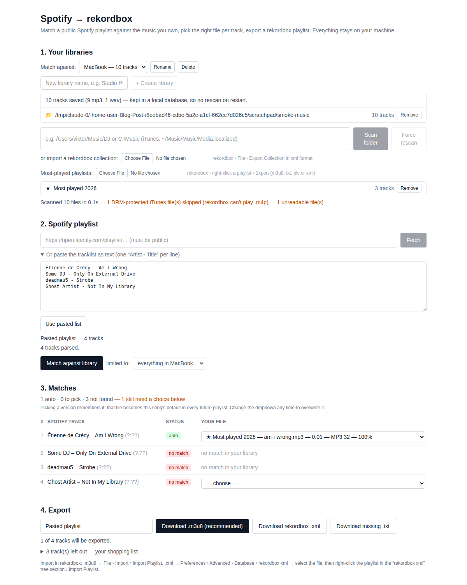

# rekord-dj

The DJ-facing half of Rekord Match: turn a **public Spotify playlist** into a
**rekordbox playlist built from music files you already own**.

1. Name a library (one per device) and load it — **scan a music folder**,
   **import a rekordbox XML export**, or both
2. Paste a Spotify playlist link (no Spotify account or API key needed)
3. It fuzzy-matches each Spotify track against your library; when several
   versions exist (original + remixes) **you pick one from a dropdown** — and it
   **remembers that pick** as the song's default for every future playlist
4. Download a `.m3u8` or rekordbox `.xml` playlist and import it into rekordbox
   — plus a `.txt` shopping list of everything the playlist wanted but you
   don't own

Plus the **couples panel**: one record per wedding gig, its magic links, and
the songs the couple and their friends filled in.



This repo is a static single-page app. All the matching, scanning and exporting
happens in the backend; this is the UI in front of it.

## The three repos

| Repo | What it holds |
| --- | --- |
| [`spotify-to-rekordbox`](https://github.com/Vikteur/spotify-to-rekordbox) | The backend: FastAPI, the matcher, the SQLite library, and the deployment topology |
| `rekord-dj` (this one) | The DJ app — library, matching, exports, and the couples panel |
| [`rekord-couple`](https://github.com/Vikteur/rekord-couple) | The couple/friends intake SPA at `/g/<token>` |

## Running it

The app needs the API. Start the backend first, from a checkout of
`spotify-to-rekordbox`:

```bash
python -m server.run          # http://127.0.0.1:8000
```

Then here:

```bash
npm install
npm run dev                   # http://127.0.0.1:5173
```

Vite proxies `/api` to `http://127.0.0.1:8000`. Point it elsewhere with
`API_URL=https://rekord.example.com npm run dev`.

| Command | What it does |
| --- | --- |
| `npm run dev` | Vite dev server, `/api` proxied to the backend |
| `npm run build` | `tsc --noEmit` then a production bundle into `dist/` |
| `npm run typecheck` | Types only |
| `npm run preview` | Serve the built bundle, `/api` still proxied |
| `npm run test:e2e` | The match-table pick/undo suite — no backend needed |
| `npm run check:couples` | Couples-panel walk-through against a real backend |

**The DJ app has no login.** No account, no sign-in, no Spotify
authentication — open `/` and you are straight in. Access control is the edge
proxy's job, and it is configured in `spotify-to-rekordbox/deploy/nginx/rekord.conf`.

> ⚠️ **Auth is switched off there on purpose and temporarily.** Deployed as-is,
> the DJ side is public — including `/api/couples`, which hands every couple's
> magic link to any caller, and `/api/scan`, which reads folders on the server.
> See the backend repo to put it back.

## What's in here

**Libraries.** Music is organised into named libraries — normally one per
device ("MacBook", "Studio PC", "USB drive"). The picker at the top of section 1
chooses which one a playlist is matched against. Libraries are fully
independent: their tracks, their sources, and their remembered version choices.
Each is built from one or more sources — a scanned folder, an imported
rekordbox XML, or several of each, merged and deduplicated by file path.

**Most-played playlists.** Upload rekordbox playlist exports per library and
the app uses them to work out which version of a song you actually play. A file
in one of your playlists is offered first and marked `★`; the dropdown next to
*Match against library* can also narrow matching to a single playlist.

**The match table.** Green *auto* rows are confident matches (still
overridable); amber *pick one* rows have several plausible files — that's the
remix picker; *no match* rows list weak guesses if any. Each candidate shows its
version (`[x remix]`, `[extended]`…), duration difference vs Spotify,
format/bitrate, and score. Keyboard: `1`–`9` ring a candidate, `Enter` commits,
`S` skips, `Esc` collapses.

**Remembered versions.** Pick a version for a song and that file becomes the
song's default in every future playlist, marked with a purple *remembered*
chip. Section 1 lists everything you've taught it, with **Forget** per entry and
**Forget all**.

**The couples panel.** One record per wedding: names, date, the two magic
links (revoke or rotate them here), the change log, and every chapter the
couple and their friends filled in. **Load & match** drops a chapter into the
normal match table, so matching and exporting work exactly like any playlist.
The intake the couple actually opens is a separate app — `rekord-couple`.

## How it talks to the backend

Everything goes through `/api` on this app's own origin: in dev the vite proxy
forwards it, in production the edge proxy does. Two build-time escape hatches
exist for when that isn't true:

| Variable | Default | Use it when |
| --- | --- | --- |
| `VITE_API_BASE` | same origin | The API is on another host |
| `VITE_GUEST_ORIGIN` | same origin | The intake app is on another host or port — this is what the couples panel puts in the magic links it hands you |

In dev the two apps are on different ports, so to copy a working magic link out
of the panel:

```bash
VITE_GUEST_ORIGIN=http://127.0.0.1:5173 npm run dev   # wherever rekord-couple is
```

## Checks

```bash
npm run test:e2e                       # 46 assertions on the pick/undo flow
API_URL=http://127.0.0.1:8000 npm run check:couples
node scripts/screenshot.mjs <music-folder>          # regenerate docs/screenshot.png
node scripts/two-library-check.mjs <folder-a> <folder-b>
node scripts/playlist-open-check.mjs <music-folder>
node scripts/missing-download-check.mjs <music-folder>
```

`test:e2e` mocks the whole API in the browser and needs nothing running. The
rest drive the real UI, so they need `npm run dev` here and the backend behind
it; they take `APP_URL` to point somewhere else. `CHROMIUM_PATH` overrides the
browser binary when neither Chrome nor Edge is installed.

## Deployment

`npm run build` produces a static bundle; the `Dockerfile` serves it from nginx.
CI pushes `ghcr.io/vikteur/rekord-dj:<sha>` on every merge to `main`. The
compose stack that runs it, and the edge proxy that routes `/` here and `/api/`
to the backend, live in `spotify-to-rekordbox/deploy/`.
